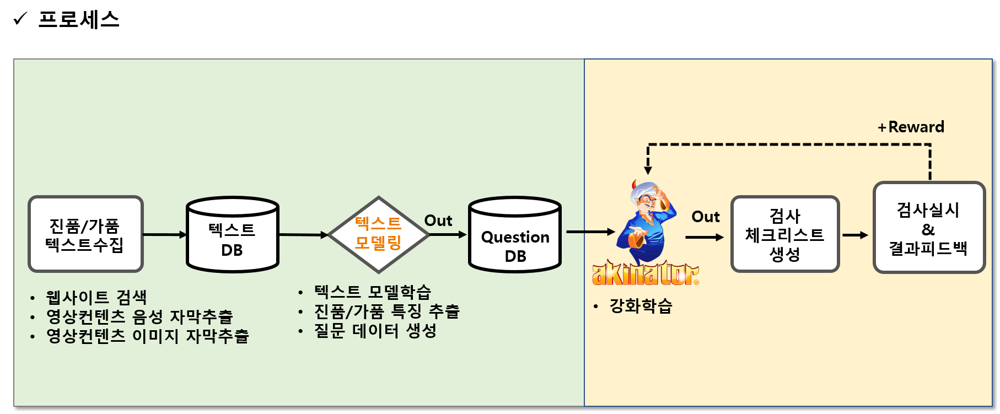

## 행사 사진

 

## 제안 아이디어

 

 

### 결론 및 기대효과
- 비전문가도 영입이 가능해 가품 감지할 수 있는 처리량이 줄어들 것이다(ex 명품감정학원 :
- 크리티컬한 질문을 할 수 있어 세관 검사 프로세스가 줄어들어 작업 효율이 상승할 것이다 

 

- 새로운 제품이 들어오면 검사에 대한 프로세스 및 메뉴얼을 '서류'로 만드는데 오래걸리고 작업자에게 학습하는데 오래걸리지만 실제 감정사가 하는 데이터를 바탕으로 빠르게 실전에서 투입할 수 있다 
- 본 프레임워크는 여러 AI기법을 통해,  최적의 check list를 자동으로 생성합니다.

 

- 통관 물품 검수자의 효율성을 돕는 보조역할을 할 수 있습니다. 
- 또한, 전문 훈련을 받지 않는 검수자를 투입하여 질적,양적 생산성을 향상 할 수 있습니다.  Ex) 쿠팡
- 이 과정에서, 현재 AI로는 어려운 인간의 오감 정보 의사결정에 활용할 수 있습니다. 
- 부가적으로, 질문과 답변의 interaction 과정에서, 양질의 data를 확보 할 수 있습니다.

 

- 이를 통해서, full-driven AI로 가는 중간다리 역할을 할 수 있습니다
